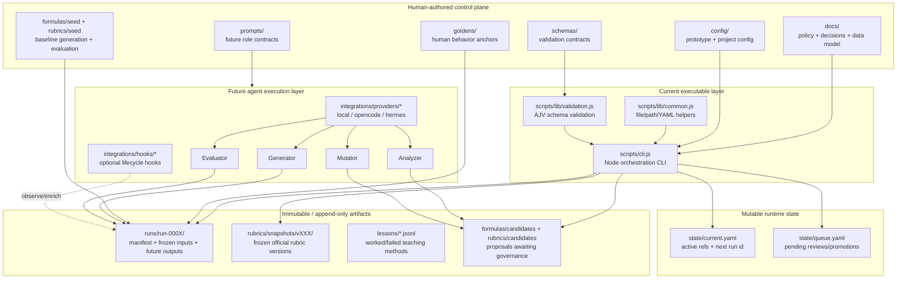
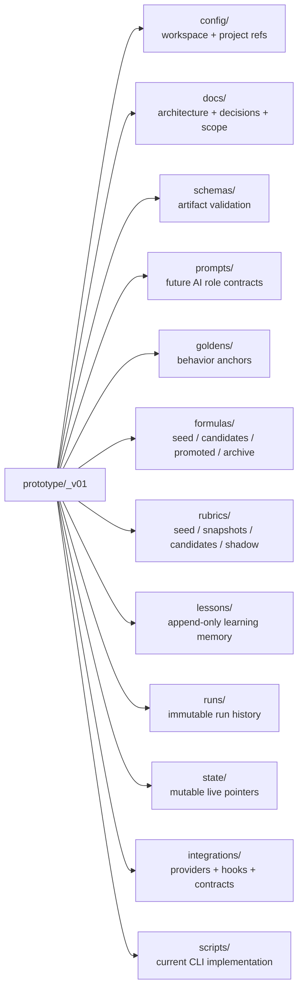
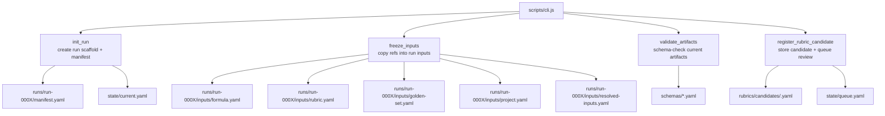
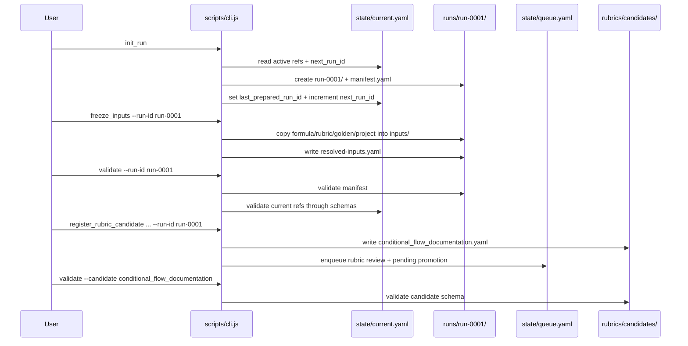
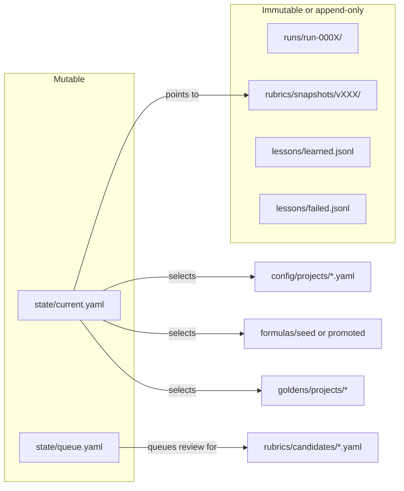
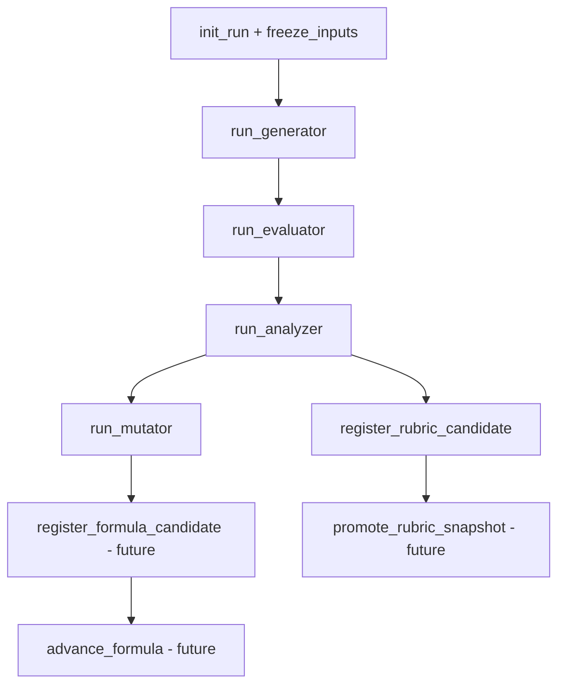

# Blueprint Mode

> A spec framework and mediation layer between human developers and AI agents — designed for brownfield and greenfield projects with bidirectional sync.

This repository currently contains the research, design docs, and the first scaffold for the **evolution prototype**.

- Product vision and architecture live under `docs/`
- Research concepts live under `concepts/`
- The working evolution prototype lives under `prototype/_v01/`

---

## Repository Map

```text
blueprint-mode/
├── docs/                 product and architecture writing
├── concepts/             focused research concepts
├── prototype/_v01/       evolution prototype scaffold
├── research_papers/      collected source papers
├── conversation_sessions/ saved brainstorm/checkpoint logs
└── AGENTS.md             project-specific agent instructions
```

---

## Evolution Prototype Architecture

The current prototype is a **file-native evolution harness scaffold**.

Its job today is to provide:
- structured state
- frozen run inputs
- rubric lifecycle boundaries
- validation contracts
- future adapter points for OpenCode / Hermes / local execution

Its job today is **not yet** to run the full Generator / Evaluator / Analyzer / Mutator AI loop.

### 1. High-Level Architecture



### 2. Prototype Folder Structure by Responsibility



### 3. Current Script Surface



### 4. Initial Run Lifecycle



### 5. What `run-0001` Contains

```text
runs/run-0001/
├── manifest.yaml
├── inputs/
│   ├── formula.yaml
│   ├── rubric.yaml
│   ├── golden-set.yaml
│   ├── project.yaml
│   └── resolved-inputs.yaml
├── generator/
├── evaluator/
├── analyzer/
└── mutator/
```

- `manifest.yaml` — run identity and active refs used
- `inputs/formula.yaml` — frozen formula for reproducibility
- `inputs/rubric.yaml` — frozen official rubric snapshot
- `inputs/golden-set.yaml` — frozen evaluation anchor
- `inputs/project.yaml` — frozen project config
- `inputs/resolved-inputs.yaml` — input provenance metadata
- role folders — placeholders for future agent outputs

### 6. State vs History



Core rule:

- `state/` changes over time
- `runs/` and official rubric snapshots should be treated as historical record

### 7. Future Agentic Loop



Design rule:

> agents propose artifacts, scripts govern lifecycle, files preserve memory.

---

## Current CLI Commands

From `prototype/_v01`:

```bash
npm run init-run
npm run freeze-inputs -- --run-id run-0001
npm run validate -- --run-id run-0001
npm run register-rubric-candidate -- --id conditional_flow_documentation --description "..." --source contextual_inference --run-id run-0001
```

---

## Reading List

- `docs/00-overview.md`
- `docs/evolution/00-spec-formula.md`
- `docs/evolution/01-evolution-system.md`
- `docs/evolution/02-multi-agent-harness.md`
- `prototype/_v01/docs/architecture-diagram.md`
