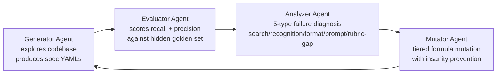
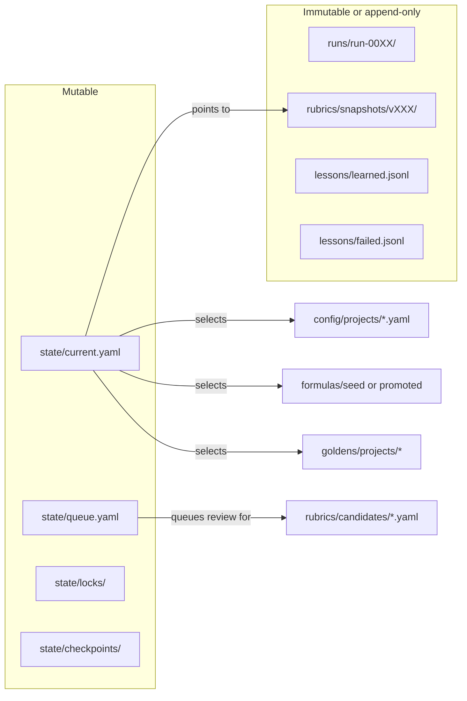

# ⚠️ Warning

**This project is an active work in progress.** APIs, schemas, and folder structures may change without notice as the evolution prototype matures.

### 💖 Sponsorships Welcome

**This project is built by a solo developer from the Philippines.** Evolution training runs consume significant AI model tokens (daily driver: Mimo v2.5). If you'd like to support the project, sponsorships help fund the training iterations needed to evolve better spec formulas. [](https://github.com/sponsors/KeentGG)

# Blueprint Mode

> A spec framework and mediation layer between human developers and AI agents — designed for brownfield and greenfield projects with bidirectional sync.

Blueprint Mode evolves spec "formulas" (prompts + steps + tools + rubric) through a multi-agent harness. Each formula run explores a codebase, generates behavioral specs, evaluates quality against a hidden golden set, diagnoses failures, and mutates the formula to close gaps. Static prompts plateau; evolved formulas converge.

---

## Repository Map

```text
blueprint-mode/
├── docs/                      product vision, architecture, decisions, roadmap
│   ├── 00-overview.md         vision, thesis, competitive landscape
│   ├── 01-decisions.md        open questions and research areas
│   ├── 02-roadmap.md          tasks, milestones, next steps
│   ├── evolution/             how formulas are trained and evolved
│   └── production/            how formulas produce specs for consumers
├── concepts/                  focused research concepts (rubric discovery, adaptive architecture)
├── prototype/_v01/            evolution prototype — the working harness
├── research_papers/           15 collected papers on agent evaluation, prompt evolution, RLHF
├── conversation_sessions/     brainstorm and checkpoint session logs
├── meta/                      compiled rubrics (aggregated artifacts)
├── AGENTS.md                  project-specific agent instructions
└── .opencode/                 OpenCode config (verification-handoff skill)
```

---

## The Problem

Existing spec frameworks work well for greenfield projects, but struggle on brownfield codebases. They can generate basic documentation — function signatures, component props, API surfaces — but tend to miss critical business logic, conditional behaviors, and edge cases. Their prompts are static, so agents don't learn *what matters* in a given codebase or *how to dig deeper*.

## The Approach

Blueprint Mode is a multi-agent evolutionary harness inspired by neural network training:

```text
Neural Net Training              Blueprint Mode
-------------------              -------------
Labeled training data        <->  Golden set (human-provided known behaviors)
Forward pass                 <->  Run formula, generate specs (blind — no golden set)
Loss function                <->  Recall + precision against golden set
Backpropagation              <->  Analyzer diagnoses WHY the formula failed
Weight update                <->  Mutator adjusts formula for next run
Epoch                        <->  Evolution cycle
```

---

## Core Logic Flow

An orchestrator runs a bounded cycle of four agents:



| Agent | Role | Input | Output |
|-------|------|-------|--------|
| **Generator** | Forward pass — explore codebase, produce specs | Formula + codebase (NO golden set) | Spec YAML files, execution trace |
| **Evaluator** | Loss function — score spec quality | Generated specs + golden set + rubric | Official score report + shadow findings |
| **Analyzer** | Backpropagation — diagnose failures | Evaluation results + execution trace | Failure type + suggested mutation |
| **Mutator** | Weight update — evolve formula | Diagnosis + lessons learned | Candidate formula mutation |

---

## Current Prototype Architecture

The prototype at `prototype/_v01/` is a **file-native evolution harness with active agent execution**. 20 runs have been executed through the full loop.

### High-Level Architecture

```mermaid
flowchart TB
  subgraph Human[Human-authored control plane]
    Docs[docs/<br/>policy + decisions]
    Config[config/<br/>prototype + project config]
    Prompts[prompts/<br/>role contracts for each agent]
    Goldens[goldens/<br/>human behavior anchors]
    Seeds[formulas/seed + rubrics/seed<br/>baseline generation + evaluation]
    Schemas[schemas/<br/>15 validation contracts]
  end

  subgraph Tooling[Executable layer]
    CLI[scripts/cli.js<br/>Node CLI — 15+ commands]
    Orch[scripts/orchestrator.js<br/>formula-driven state machine]
    Lib[scripts/lib/<br/>common, validation, lessons, agent, schema-validator]
  end

  subgraph Agents[Active agent execution]
    Generator[Generator Agent]
    Evaluator[Evaluator Agent]
    Analyzer[Analyzer Agent]
    Mutator[Mutator Agent]
    Harness[blueprint-harness skill<br/>AGENTS.md orchestrator]
  end

  subgraph LiveState[Mutable runtime state]
    Current[state/current.yaml<br/>active refs + next run id]
    Queue[state/queue.yaml<br/>pending reviews/promotions]
    Locks[state/locks/<br/>run concurrency control]
    Checkpoints[state/checkpoints/<br/>run phase tracking]
  end

  subgraph History[Immutable / append-only artifacts]
    Runs[runs/<br/>20 executed runs]
    Snapshots[rubrics/snapshots/<br/>frozen official rubric versions]
    Lessons[lessons/<br/>learned.jsonl + failed.jsonl]
    Candidates[formulas/candidates + rubrics/candidates<br/>proposals awaiting governance]
  end

  Docs --> CLI
  Config --> CLI
  Schemas --> Lib
  Prompts --> Agents
  CLI --> Current
  CLI --> Queue
  CLI --> Runs
  CLI --> Candidates
  Goldens --> Runs
  Seeds --> Runs
  Agents --> Runs
  Harness --> Agents
  Lessons --> Agents
```



### Prototype Folder Structure

```text
prototype/_v01/
├── config/              workspace + project config
├── docs/                architecture decisions + data model
├── schemas/             15 artifact validation contracts (AJV)
├── prompts/             role-specific agent prompts
│   ├── generator.md     generator role contract
│   ├── evaluator.md     evaluator role contract
│   ├── analyzer.md      analyzer role contract
│   ├── mutator.md       mutator role contract
│   └── shared/          failure-types.md, output-contracts.md
├── goldens/             golden-set behavior anchors per project
├── formulas/            seed / candidates / promoted / archive
├── rubrics/             seed / snapshots / candidates / shadow
├── lessons/             append-only learned.jsonl + failed.jsonl
├── runs/                20 immutable per-run artifacts
├── state/               mutable live pointers, queues, locks, checkpoints
├── integrations/        provider adapters + hook extension points
├── scripts/             CLI + orchestrator + lib
│   ├── cli.js           15+ commands (init, freeze, run_*, register_*, validate, etc.)
│   ├── orchestrator.js  formula-driven state machine for full loop execution
│   └── lib/             common, validation, lessons, agent, schema-validator
└── AGENTS.md            harness orchestrator instructions (blueprint-harness skill)
└── .opencode/skills/    blueprint-harness skill definition
```

### Run Structure

Each run produces a complete audit trail:

```text
runs/run-00XX/
├── manifest.yaml              run identity + frozen refs
├── inputs/                    frozen inputs (formula, rubric, golden-set, project)
│   ├── formula.yaml
│   ├── rubric.yaml
│   ├── golden-set.yaml
│   ├── project.yaml
│   └── resolved-inputs.yaml
├── generator/
│   ├── output.yaml            generation status + confidence scores
│   ├── trace.json             full execution trace (requests, responses, latency)
│   ├── steps/                 per-step output artifacts
│   └── specs/                 generated behavioral spec YAMLs
├── evaluator/
│   ├── output.yaml            official score report (recall, precision, overall)
│   └── shadow-findings.yaml   rubric gap candidates, consistency issues
├── analyzer/
│   └── output.yaml            failure diagnosis + suggested mutation
└── mutator/
    └── output.yaml            proposed formula mutation + insanity check
```

### Formula Hierarchy

Formulas follow an inheritance model — ecosystem specializations extend the universal baseline:

```text
formulas/
├── seed/
│   ├── universal.yaml         base steps: explore → analyze → draft → verify → cross-ref
│   ├── frontend.yaml          extends universal — stateful UI, conditional rendering, a11y
│   └── backend.yaml           extends universal — API patterns, auth, middleware
├── candidates/                mutations proposed by the Mutator agent
├── promoted/                  formulas that passed governance review
└── archive/                   retired or superseded formulas
```

### Lessons Learned

The "insanity prevention" system — never retry a failed teaching method:

```text
lessons/
├── index.yaml                 lookup table by failure_type × teaching_method
├── learned.jsonl              what worked and on what failure types
└── failed.jsonl               what didn't work — prevents retries
```

---

## CLI Commands

From `prototype/_v01`:

```bash
# Run lifecycle
node scripts/cli.js init_run --run-id run-0025
node scripts/cli.js freeze_inputs --run-id run-0025
node scripts/cli.js run_generator --run-id run-0025
node scripts/cli.js run_evaluator --run-id run-0025
node scripts/cli.js run_analyzer --run-id run-0025
node scripts/cli.js run_mutator --run-id run-0025

# Checkpoint and resume
node scripts/cli.js checkpoint_run --run-id run-0025 --phase generator --status complete
node scripts/cli.js resume_run --run-id run-0025

# Rubric governance
node scripts/cli.js register_rubric_candidate --id criterion_id --description "..." --source contextual_inference --run-id run-0025
node scripts/cli.js approve_rubric_candidate --id criterion_id --target-state probation
node scripts/cli.js reject_rubric_candidate --id criterion_id --reason "..."
node scripts/cli.js promote_rubric_snapshot --version v003

# Formula governance
node scripts/cli.js register_formula_candidate --file formulas/candidates/example.yaml
node scripts/cli.js advance_formula --id frontend-v002

# Validation
node scripts/cli.js validate_artifacts --run-id run-0025
node scripts/cli.js validate_seed_rubrics
```

Or run the full loop with the orchestrator:

```bash
node scripts/orchestrator.js --run-id run-0025
```

---

## Execution Modes

### Blueprint Harness (AGENTS.md)

The OpenCode agent orchestrates the full evolution cycle as a bounded task:

```
init → freeze → explore → delegate → evaluate → analyze → mutate → register → STOP
```

- The orchestrator explores the codebase itself (no subagents in explore phase)
- Spawns spec-generator, evaluator, analyzer, and mutator as ephemeral subagents
- Golden set is hidden from the generator — blind test
- Insanity prevention: checks lessons/failed.jsonl before proposing mutations

### Formula-Driven Orchestrator (orchestrator.js)

A Node.js state machine that executes formula steps sequentially:

```text
init → freeze → generate (formula steps) → evaluate → analyze → mutate → register
```

- Template-driven prompts with context injection
- Schema validation gates between steps
- Retry logic (3 attempts per step)
- Mechanical + agent evaluation (weighted scoring)

---

## State vs History



Core rule: `state/` changes over time. `runs/` and official rubric snapshots are historical record.

---

## Design Principles

1. **Files are the memory** — agents are ephemeral processors; state lives in YAML/JSONL
2. **Agents propose, scripts govern** — no agent can promote a formula or rubric without going through governance
3. **Golden set is a hidden test** — the generator never sees it; blind evaluation
4. **Insanity prevention** — never retry a teaching method that already failed for the same failure type
5. **Official vs shadow** — official scoring stays machine-comparable; rubric discovery lives in shadow findings until governed
6. **Frozen inputs** — official runs use frozen formula + rubric for reproducibility

---

## Milestones

- [x] **Milestone 1:** Build the harness — backbone, baseline formula, orchestrator loop, golden set structure, lessons_learned format
- [x] **Milestone 2:** First evolution cycle — run against a real codebase, evaluate, diagnose, mutate
- [x] **Milestone 2c:** Agent Harness — OpenCode agent orchestrates the full loop autonomously
- [ ] **Milestone 2b:** Rubric discovery v1 — Analyzer can identify rubric gaps
- [ ] **Milestone 3:** Ecosystem specialization — frontend/backend/mobile formulas diverge
- [ ] **Milestone 3b:** Rubric discovery v2 — Mutator can add discovered criteria (Self-Evolving)
- [ ] **Milestone 4:** Fine-tuned judge model
- [ ] **Milestone 5:** Community formulas

---

## Reading List

- `docs/00-overview.md` — vision, thesis, competitive landscape
- `docs/evolution/00-spec-formula.md` — the recipe for producing specs
- `docs/evolution/01-evolution-system.md` — how formulas are trained
- `docs/evolution/02-multi-agent-harness.md` — the agents that run evolution
- `prototype/_v01/AGENTS.md` — harness orchestrator instructions
- `prototype/_v01/README.md` — prototype-specific details
